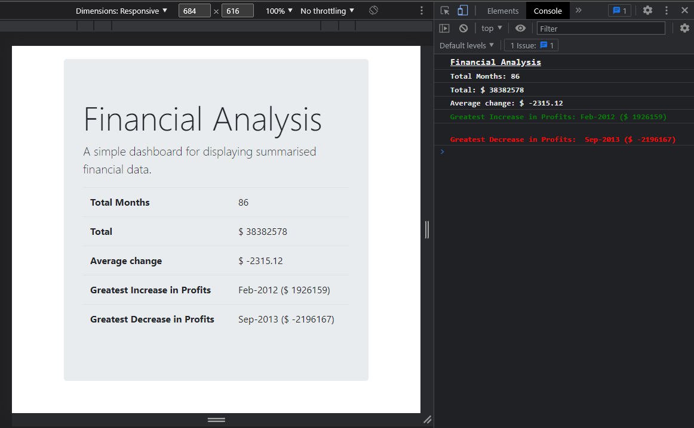

 

  <h1 align="center">Console Finances</h1>
  

    A web app that analyses the financial records of a company.
     
    <a href="https://osmantolo.github.io/Console-Finances/">View Demo</a>
  

## About The Project

This repo presents a web app that analyses the financial records of a company. It serves as my solution to the Module 4 - Console Finance Challenge of Trilogy Skills Front-End Development Boot Camp. The project provide evidence of my ability to analyse, manipulate, create and present data using JavaScript, and present the data to the user in the console and on the website. The result is a user friendly single page website that can be accessed by anyone with an internet connection.

## Usage

Visit this github page [link](https://osmantolo.github.io/Console-Finances/) to access the website. You can navigate to the console by accessing the inspect option for your specific browser.

## License

Distributed under the MIT License.

## Contact

Osman Dumbuya - [@OsmanTolo\_](https://twitter.com/OsmanTolo_)

Project Link: [https://github.com/OsmanTolo/console-Finances](https://github.com/OsmanTolo/Console-Finances)

## Acknowledgments

- [Skills for Life](https://skillsforlife.campaign.gov.uk/courses/skills-bootcamps/)
- [Othneil Drew's Best-README-Template](https://github.com/othneildrew/Best-README-Template)
